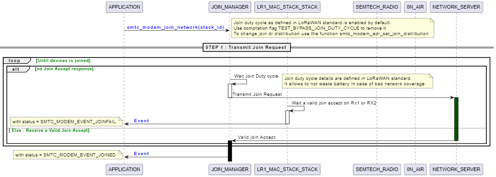
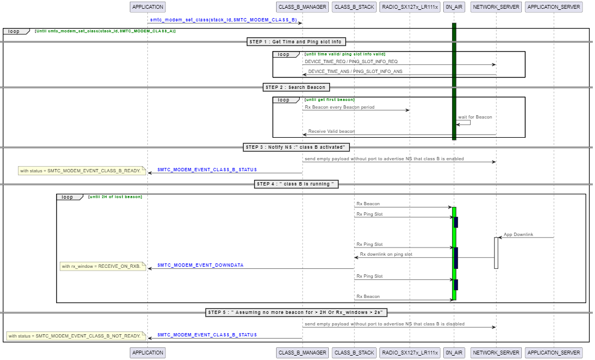

# LoRa Basic Modem

**LoRa Basic Modem** proposes an implementation of the [TS001-LoRaWAN L2 1.0.4](https://resources.lora-alliance.org/technical-specifications/ts001-1-0-4-lorawan-l2-1-0-4-specification) and [Regional Parameters RP2-1.0.3](https://resources.lora-alliance.org/technical-specifications/rp2-1-0-3-lorawan-regional-parameters) specifications.

## Key Features

- **Class A**: Supports Class A operation
- **Class B**: Supports Class B operation (with up to 4 multicast sessions)
- **Class C**: Supports Class C operation (with up to 4 multicast sessions)
- **Region Support**:
  - AS923 (AS923-1, AS923-2, AS923-3, AS923-4)
    - `SMTC_MODEM_REGION_AS_923_GRP1`
    - `SMTC_MODEM_REGION_AS_923_GRP2`
    - `SMTC_MODEM_REGION_AS_923_GRP3`
    - `SMTC_MODEM_REGION_AS_923_GRP4`
  - AU915
    - `SMTC_MODEM_REGION_AU_915`
  - CN470
    - `SMTC_MODEM_REGION_CN_470`
    - `SMTC_MODEM_REGION_CN_470_RP_1_0`
  - EU868
    - `SMTC_MODEM_REGION_EU_868`
  - IN865
    - `SMTC_MODEM_REGION_IN_865`
  - KR920
    - `SMTC_MODEM_REGION_KR_920`
  - RU864
    - `SMTC_MODEM_REGION_RU_864`
  - US915
    - `SMTC_MODEM_REGION_US_915`

  **Note**: In addition the proposed implementation also provides a 2.4 GHz global ISM band (WW2G4) region support.

- **Semtech Radios Support**:
  - LR1110 with firmware 0x0401.
  - LR1120 with firmware 0x0201
  - LR1121 with firmware 0x0103
  - SX1261, SX1262, SX1268
  - SX1280, SX1281
  - Experimental: SX1272, SX1276

- **Secure Elements**:
  Supports both software-emulated and hardware secure-elements, providing necessary cryptographic operations for LoRaWAN protocol.

- **MCU Abstraction Layer**:
  Facilitates porting with the following required MCU hardware resources:
  - 1 HW timer.
  - 1 SPI interface.
  - Minimum 40 KB of FLASH is required to operate in Class A with a single region (EX:EU868). Each additional region adds approximately 1.5 KB.
  - Minimum 6KB of RAM memory.
  - 48B of non-volatile memory to store LoRaWAN and modem context.
    Up to 512B of non-volatile memory if a software-emulated secure-element is used.
  - Optional 1 Watchdog.

- **Activation Methods**:
  - Supports OTAA activation by default
  - ABP activation is implemented only for debugging purposes.
    **Note:** No stack context is saved in non-volatile memory. Therefore, it is strongly discouraged to use this mode for any other purpose than debugging.

- **Porting Options**:
  - Supports Bare Metal or RTOS-based projects.

## LoRa Basics Modem Options

### Build process

The build process using the makefile allows flexibility in choosing different compile-time options.
To explore all available make process options, run:

```bash
make -C help
```

Build process options can be provided either using the command line or by editing  [options.mk](makefiles/options.mk)

### Radio Targets

Support for the following transceivers can be selected at build time:

- sx128x - SX1280 & SX1281 Transceivers.
- lr1110 - LR1110 Transceiver.
- lr1120 - LR1120 Transceiver.
- lr1121 - LR1121 Transceiver.
- sx1261 - SX1261 Transceiver.
- sx1262 - SX1262 Transceiver.
- sx1268 - SX1268 Transceiver.
- sx1272 - SX1272 Transceiver.
- sx1276 - SX1276 Transceiver.

LoRa Basics™ Modem (LBM) should be built for a specific transceiver by using the basic_modem_<TARGET> parameter.

### MCU Flags

MCU flags are passed to the compiler through the MCU_FLAGS build parameter. The flags are set as a single text string.

For example, to build LoRa Basics Modem for an STM32L4 MCU the following MCU_FLAGS are used:
`MCU_FLAGS="-mcpu=cortex-m4 -mthumb -mfpu=fpv4-sp-d16 -mfloat-abi=hard"`

### Regions

Support for one or more of the following regions can be selected at compile time:

- AS_923 - AS923MHz ISM Band. Group selection is performed at runtime through the API.
- AU_915 - AU915-928MHz ISM Band.
- CN_470 - CN470-510MHz Band.
- CN_470_RP_1_0 - CN470-510MHz Band. LoRaWAN Regional Parameters v1.0 version.
- EU_868 - EU863-870MHz ISM Band.
- IN_865 - IN865-867MHz ISM Band.
- KR_920 - KR920-923MHz ISM Band.
- RU_864 - RU864-870MHz ISM Band.
- US_915 - US902-928MHz ISM Band.
- WW_2G4 - Emulation of the LoRaWAN Standard for the 2.4GHz global ISM band.
The supported regions are selected through the REGION build option. If the user does not explicitly select one or more
regions, all regions are included at compile time.

### Cryptographic Engine Selection

LR11xx Transceivers include a Cryptographic Engine which provides a dedicated hardware accelerator for AES-128 encryption based algorithms. This Cryptographic Engine improves the power efficiency of cryptographic operations and reduces the code size of the software stack. Alternatively, LBM includes a software-implemented Cryptographic Engine.
The selection of the Cryptographic Engine to use is done through the CRYPTO parameter. The following options are available:

- **SOFT** - Use the LoRa Basics Modem Cryptographic Engine (Default).
- **LR11XX** - Use the LR11xx Cryptographic Engine with user defined keys.
- **LR11XX_WITH_CREDENTIALS** - Use the LR11xx Cryptographic Engine with pre-provisioned EUIs and keys.

### LoRa Basics Modem Features Selection

The user can choose which feature to embed in LoRa Basics Modem by updating [options.mk](makefiles/options.mk).

**LoRaWAN Stack related options**:

- LBM_CLASS_B: Enable compilation of class B feature
- LBM_CLASS_C: Enable compilation of class C feature
- LBM_MULTICAST: Enable compilation of LoRaWAN multicast feature
- LBM_CSMA: Enable compilation of CSMA feature
- LBM_RELAY_TX_ENABLE : Enable compilation of Relay Tx feature
- LBM_RELAY_RX_ENABLE : Enable compilation of Relay Rx feature

**LoRaWAN packages related options**:

- LBM_ALC_SYNC: Enable compilation of LoRaWAN ALCSync package
- LBM_ALC_SYNC_VERSION: to choose with version of ALCSync package shall be built
- LBM_FUOTA: Enable compilation of LoRaWAN FUOTA dedicated packages
- LBM_FUOTA_VERSION: to choose the version of FUOTA packages

**LoRaCloud related options**:

- LBM_ALMANAC: Enable compilation of the almanac update service
- LBM_STREAM: Enable compilation of the Stream service
- LBM_LFU: Enable compilation of the Large File Upload service
- LBM_DEVICE_MANAGEMENT: Enable compilation of the device management service

**Miscellaneous options**:

- LBM_GEOLOCATION: Enable compilation of the geolocation service
- LBM_STORE_AND_FORWARD: Enable compilation of the store and forward service

### EXTRAFLAGS Usage

Build time parameters are passed to the compiler through the use of the EXTRAFLAGS parameter.
For example, to change the internal radio planner margin delay value the following build command line can be used:

```bash
make basic_modem_<TARGET> MCU_FLAGS=xxx EXTRAFLAGS="-DRP_MARGIN_DELAY=12"
```

### Debug and Optimization options

The following options can be enabled for debugging:

- VERBOSE=yes/no - Increase build verbosity (default: no).
- DEBUG=yes/no - Enable debugging options (default: no).
- MODEM_TRACE=yes/no - Choose to enable or disable modem trace print (default: yes).

Build optimization can be chosen by updating `OPT` and `DEBUG_OPT` options

## Developing an Application with LoRa Basics Modem

### User application

Initialize the stack by invoking the `smtc_modem_init()` API.
Subsequently, call the `smtc_modem_run_engine()` API periodically to progress the internal state machine of the stack. The return value of the `smtc_modem_run_engine()` API indicates when the next task will be handled.  Whenever a stack-related interruption occurs, call the `smtc_modem_run_engine()` API to process it and take necessary actions.
Before entering a low-power wait mode, ensure no stack pending actions exist by using the `smtc_modem_is_irq_flag_pending()` API.

Find the definitions for these APIs in [smtc_modem_utilities.h](smtc_modem_api/smtc_modem_utilities.h)

### Modem API

Refer to [smtc_modem_api.h](smtc_modem_api/smtc_modem_api.h) for the Application Programming Interface definitions.

### Modem HAL

For porting LoRa Basics Modem to a new architecture/platform, implement functions defined in [smtc_modem_hal.h](smtc_modem_hal/smtc_modem_hal.h).

### Radio BSP (Board Specific Package) and HAL (Hardware Abstraction Layer)

Semtech radio drivers and Radio Abstraction Layer (RAL) architecture requires the user to implement the radio HAL and BSP functions.

Radio BSP functions are defined for each transceiver and can be found in [smtc_modem_core/smtc_ral/src](smtc_modem_core/smtc_ral/src) folder. (Files named `ral_xxx_bsp.h`).

Radio HAL functions are defined for each transceiver in [smtc_modem_core/radio_drivers](smtc_modem_core/radio_drivers) folder.

### Fetch an Event

Utilize the shared callback during initialization to be informed of incoming events.
Retrieve pending events by calling `smtc_modem_get_event()`.
Unstack pending events with successive calls to `smtc_modem_get_event()` until `SMTC_MODEM_RC_NO_EVEN`T return code is received.

### Join a LoRaWAN Network

Before initiating a join procedure, set LoRaWAN parameters using the following functions:

- LoRaWAN region with `smtc_modem_set_region()` (can only be changed when the modem is not joining or joined)
- Configure EUIs and key parameters with functions such as `smtc_modem_set_deveui()`, `smtc_modem_set_joineui()` and `smtc_modem_set_nwkkey()`.
- If needed set the type of network (private or public) using `smtc_modem_set_network_type()` (default is public).

Once parameters are set, start joining a LoRaWAN network by calling `smtc_modem_join_network()`.
The user is informed of the procedure's progress via two events:

- `SMTC_MODEM_EVENT_JOINED`: Join accept received; the join procedure is complete.
- `SMTC_MODEM_EVENT_JOINFAIL`: Nothing received after the join request; the join procedure continues.

Cancel an ongoing join procedure or leave an already-joined network by calling `smtc_modem_leave_network()`.

#### Join Sequence



### Send Data Over LoRaWAN

The user can send a standard uplink, while being connected, with the following functions:

- `smtc_modem_request_uplink()`
- `smtc_modem_request_emergency_uplink()` to send data with the highest priority, ignoring duty cycle restriction
- `smtc_modem_request_empty_uplink()` to send an empty payload with an optional FPort field, creating a downlink opportunity

Transmission status will be available through the event `SMTC_MODEM_EVENT_TXDONE` and can be one of the following:

- `SMTC_MODEM_EVENT_TXDONE_NOT_SENT`: Transmission was not completed.
- `SMTC_MODEM_EVENT_TXDONE_SENT`: Transmission was completed successfully.
- `SMTC_MODEM_EVENT_TXDONE_CONFIRMED`: Transmission was completed successfully, and an acknowledgment was received from the network.

### Receive Data Over LoRaWAN

Upon receiving a downlink with data for the application, the event `SMTC_MODEM_EVENT_DOWNDATA` is triggered.
Retrieve data and metadata by calling `smtc_modem_get_downlink_data()`.
Available metadata includes RSSI, SNR, reception window, FPort, FPending bit, frequency, and datarate.

### Manage a LoRaWAN Connection Lifecycle

Once connected to a LoRaWAN network, configure parameters:

- ADR profile with `smtc_modem_adr_set_profile()`
- Number of transmissions for each unconfirmed uplink with `smtc_modem_set_nb_trans()`

Retrieve information about the connection:

- Duty cycle limitation status with `smtc_modem_get_duty_cycle_status()`
- Maximum size of the next uplink with `smtc_modem_get_next_tx_max_payload()`
- Available datarates with `smtc_modem_get_enabled_datarates()`
- Number of consecutive uplinks without downlink with `smtc_modem_lorawan_get_lost_connection_counter()`

### Carrier Sense Multiple Access (CSMA) for LoRaWAN

The modem supports a CSMA (Carrier Sense Multiple Access) feature designed to prevent collisions in LoRa packet transmissions.
LoRa Alliance Technical Recommendations can be read at [TR0013](https://resources.lora-alliance.org/home/tr013-1-0-0-csma)

To enable CSMA during compilation, set the option `LBM_CSMA=yes` in the Makefile.
By default, CSMA is activated at modem startup if the compilation option `USE_CSMA_BY_DEFAULT=yes` is configured.

Toggle the CSMA feature on or off using the function `smtc_modem_csma_set_state()`.
For tailored optimization to specific use cases, configure CSMA parameters with the function `smtc_modem_csma_set_parameters()`.

**Note**: CSMA support is limited to lr11xx and sx126x radios. Activating this feature on other targets may result in undesirable behavior or modem panic.

### LoRaWAN Class B

LoRa Basic Modem does not support Class B by default. To use this feature, it must be activated during project compilation.

#### Activating Class B Support

Activate Class B support by setting the flag `LBM_CLASS_B` to yes in the [options.mk](makefiles/options.mk) file. This enables Class B functionality in LoRa Basic Modem.

#### Starting Class B

Initiate Class B after a successful join, preferably after receiving the `SMTC_MODEM_EVENT_JOINED` event.
Start Class B by calling `smtc_modem_set_class()` with the parameter `SMTC_MODEM_CLASS_B`.
LoRa Basic Modem autonomously handles prerequisites for Class B in LoRaWAN.

To change the ping slot periodicity (default is 7, meaning a ping slot every 128 seconds), call `smtc_modem_class_b_set_ping_slot_periodicity()` before `smtc_modem_set_class()`.

#### Special Cases

- If your network server doesn't support time synchronization via a network command, activate the clk sync package to set the GPS time before starting Class B.
- If no longer connected to the LoRaWAN network, Class B automatically stops after 2 hours without receiving a beacon. The user receives the `SMTC_MODEM_EVENT_CLASS_B_STATUS`

#### Class B Sequence



### LoRaWAN Multicast

Up to 4 multicast groups can be configured by calling `smtc_modem_multicast_set_grp_config()` with the following parameters
for each group to be configured:

- Group ID
- Address
- Network session key
- Application session key

To retrieve the group address of a specific group ID, use `smtc_modem_multicast_get_grp_config()`.

#### LoRaWAN Multicast in Class B

In Class B mode, when multicast groups are configured, initiate each session by calling `smtc_modem_multicast_class_b_start_session()` with the following parameters:

- Group ID
- Frequency
- Datarate
- Ping slot

For Class B multicast downlinks, use `smtc_modem_get_downlink_data()` after the `SMTC_MODEM_EVENT_DOWNDATA` event, and check the window metadata with `SMTC_MODEM_DL_WINDOW_RXB_MC_GRPx` (x being the multicast group ID).
Retrieve the current session status with `smtc_modem_multicast_class_b_get_session_status()` and stop a multicast session with `smtc_modem_multicast_class_b_stop_session()`.
To halt all Class B multicast sessions, use `smtc_modem_multicast_class_b_stop_all_sessions()`.

#### LoRaWAN Multicast in Class C

In Class C mode, when multicast groups are configured, initiate each session with `smtc_modem_multicast_class_c_start_session()` and provide:

- Group ID
- Frequency
- Datarate

Class C multicast downlinks are available by fetching downlink data with `smtc_modem_get_downlink_data()` after the event `SMTC_MODEM_EVENT_DOWNDATA` triggered. The window metadata value with `SMTC_MODEM_DL_WINDOW_RXC_MC_GRPx`(x being the multicast group ID).
It is possible to read back the status of the current session by calling `smtc_modem_multicast_class_c_get_session_status()`.
A multicast session can be stopped by calling `smtc_modem_multicast_class_c_stop_session()`.
All class C multicast sessions can be stopped by calling `smtc_modem_multicast_class_c_stop_all_sessions()`.

If the frequency or datarate of the first session differs from the current unicast Class C configuration, it will automatically switch. However, if subsequent sessions have different configurations, they cannot be started until all ongoing sessions are stopped with `smtc_modem_multicast_class_c_stop_session()`.
For Class C multicast downlinks, use `smtc_modem_get_downlink_data()` after the `SMTC_MODEM_EVENT_DOWNDATA` event, and check the window metadata with `SMTC_MODEM_DL_WINDOW_RXC_MC_GRPx` (x being the multicast group ID).
Retrieve the current session status with `smtc_modem_multicast_class_c_get_session_status()` and stop a multicast session with `smtc_modem_multicast_class_c_stop_session()`.
To halt all Class C multicast sessions, use `smtc_modem_multicast_class_c_stop_all_sessions()`.

### LoRaWAN Mac Request

Initiate LoRaWAN-specific Mac requests with `smtc_modem_trig_lorawan_mac_request()`.

#### LoRaWAN Link Check Request

Use `smtc_modem_trig_lorawan_mac_request()` with the `SMTC_MODEM_LORAWAN_MAC_REQ_LINK_CHECK` bit mask to generate a LoRaWAN Link Check Request uplink.  
Transmission status is available through the `SMTC_MODEM_EVENT_LINK_CHECK` event:

- `SMTC_MODEM_EVENT_MAC_REQUEST_NOT_ANSWERED`: No answer received from the network.
- `SMTC_MODEM_EVENT_MAC_REQUEST_ANSWERED`: Valid answer received; data can be fetched using `smtc_modem_get_lorawan_link_check_data()`.

#### LoRaWAN Device Time Request

Use `smtc_modem_trig_lorawan_mac_request()` with the `SMTC_MODEM_LORAWAN_MAC_REQ_DEVICE_TIME` bit mask to generate a LoRaWAN Device Time Request uplink.  
Transmission status is available through the `SMTC_MODEM_EVENT_LORAWAN_MAC_TIME` event:

- `SMTC_MODEM_EVENT_MAC_REQUEST_NOT_ANSWERED`: No answer received from the network.
- `SMTC_MODEM_EVENT_MAC_REQUEST_ANSWERED`: Valid answer received; time can be fetched using `smtc_modem_get_lorawan_mac_time()`.

#### LoRaWAN Ping Slot Info Request

Use `smtc_modem_trig_lorawan_mac_request()` with the `SMTC_MODEM_LORAWAN_MAC_REQ_PING_SLOT_INFO` bit mask to generate a LoRaWAN Ping Slot Info Request uplink.  
Transmission status is available through the `SMTC_MODEM_EVENT_CLASS_B_PING_SLOT_INFO` event:

- `SMTC_MODEM_EVENT_MAC_REQUEST_NOT_ANSWERED`: No answer received from the network.
- `SMTC_MODEM_EVENT_MAC_REQUEST_ANSWERED`: Network acknowledged the request.

## LoRa Basics Modem Additional Features

### LoRaWAN Certification Protocol handling

The LoRaWAN Certification package is essential during the LoRaWAN certification process. Follow these steps:

1. Set LoRaWAN keys with `smtc_modem_set_deveui()`, `smtc_modem_set_joineui()`, `smtc_modem_set_nwkkey()` and `smtc_modem_set_appkey()`.
2. Connect to the network with `smtc_modem_join_network()`
3. Launch the certification service with `smtc_modem_set_certification_mode()`. This command saves a flag in NVM to permit the certification to reset the MCU when required and continue the certification process at boot.

### Application Layer Clock Synchronization (ALCSync)

Use this application when a Network Server doesn't support the DeviceTimeReq commands.
Activate ALCSync support by setting the flag `LBM_ALC_SYNC` to yes in the [options.mk](makefiles/options.mk) file

When started the application will trig a time synchronization to the application server every `periodicity_s` configured by the ALCSync server package.
The default value is 36h.
Each time a valid time sync answer is received by the modem, it will generate an event of type `SMTC_MODEM_EVENT_ALCSYNC_TIME`

Start the service with `smtc_modem_start_alcsync_service()`.
Stop the service with `smtc_modem_stop_alcsync_service()`.
Get GPS epoch time, number of seconds elapsed since GPS epoch (00:00:00, Sunday 6th of January 1980) with `smtc_modem_get_alcsync_time()`
Trigger a single uplink requesting time on Application Layer Clock Synchronization (ALCSync) service with `smtc_modem_trigger_alcsync_request()`, the service must be start first.

## FUOTA (Firmware Update Over The Air)

The FUOTA service in LoRa Basics Modem aligns with the firmware update standard established by the LoRa Alliance. It encompasses five Applicative Packages outlined in the LoRaWAN standard:

- **LoRaWAN Remote Multicast Setup** Specification:
  - [TS005-1.0.0](https://resources.lora-alliance.org/technical-specifications/lorawan-remote-multicast-setup-specification-v1-0-0)
  - [TS005-2.0.0](https://resources.lora-alliance.org/technical-specifications/ts005-2-0-0-remote-multicast-setup)
- **LoRaWAN Fragmented Data Block Transport** Specification:
  - [TS004-1.0.0](https://resources.lora-alliance.org/technical-specifications/lorawan-fragmented-data-block-transport-specification-v1-0-0)
  - [TS004-2.0.0](https://resources.lora-alliance.org/technical-specifications/ts004-2-0-0-fragmented-data-block-transport)
- **LoRaWAN Application Layer Clock Synchronization** Specification:
  - [TS003-1.0.0](https://resources.lora-alliance.org/technical-specifications/lorawan-application-layer-clock-synchronization-specification-v1-0-0)
  - [TS003-2.0.0](https://resources.lora-alliance.org/technical-specifications/ts003-2-0-0-application-layer-clock-synchronization)
- **Firmware Management Protocol** Specification: [TS006-1.0.0](https://resources.lora-alliance.org/technical-specifications/ts006-1-0-0-firmware-management-protocol)
- **Multi-Package Access** Specification: [TS007-1.0.0](https://resources.lora-alliance.org/technical-specifications/ts007-1-0-0-multi-package-access)

This library offers the implementation of LoRaWAN Alliance's V1 and V2 Fuota packages
The proposed implementation supports both Class B or Class C modes and supports up to 4 simultaneous multicast sessions.

### FUOTA Activation

FUOTA is not enabled by default in LoRa Basics™ Modem.
To activate it during project compilation, set the `LBM_FUOTA` flag to `yes` and set the `LBM_FUOTA_VERSION` flag to chosen version number 1 or 2 in [options.mk](makefiles/options.mk).

Multi-Package Access is not automatically added to compilation even if `LBM_FUOTA` flag is set to `yes`. User shall set `LBM_FUOTA_ENABLE_MPA` to yes to use it.

Additionally, provide the following compilation fields:

- `FUOTA_MAXIMUM_NB_OF_FRAGMENTS`
- `FUOTA_MAXIMUM_SIZE_OF_FRAGMENTS`
- `FUOTA_MAXIMUM_FRAG_REDUNDANCY`

Class B, Class C, multicast, and the previously mentioned packages are automatically built by activating this compilation flag.

#### Prerequisites before starting a FUOTA session

Two essential functions must be implemented for the FUOTA service:

- `smtc_modem_hal_context_store` for the `CONTEXT_FUOTA` parameter
- `smtc_modem_hal_context_restore` function

These functions ensure that the received firmware update file is stored in non-volatile memory during the FUOTA session.

#### Starting a Class C FUOTA session

To initiate a multicast session in Class C, no specific action is required; it is handled transparently based on fuota server requests.
If your Network server does not support the network Device Time Request cmd, activate the clk sync service (refer to the specific chapter on this service).

#### End of Class C FUOTA session

The implemented service only takes care of the transfer/reconstruction of the file and its storage in non-volatile memory. Everything related to the implementation of the new firmware itself (reboot, dual bank, etc.) is not implemented in this service and is left to the implementation of the end user.

Once the session is completed, the user receives an event: `SMTC_MODEM_EVENT_LORAWAN_FUOTA_DONE` with the status "true" if the transfer is completed without error.

The FUOTA service manages the transfer and reconstruction of the file, storing it in non-volatile memory.
Implementation of the new firmware (reboot, dual bank, etc.) is not part of this service and is left to the end user.
After completion, the user receives an event `SMTC_MODEM_EVENT_LORAWAN_FUOTA_DONE` with a `true` status if the transfer is completed without errors.

#### Remark

The fragmentation session for FUOTA may end, but not the Class C multicast session. The latter remains active until the session timeout. The user can end the session when they receive the `SMTC_MODEM_EVENT_LORAWAN_FUOTA_DONE` event. Alternatively, they can let the multicast session continue until the timeout, receiving an event `SMTC_MODEM_EVENT_NO_MORE_MULTICAST_SESSION_CLASS_C`.  At the session start, they will receive an event `SMTC_MODEM_EVENT_NEW_MULTICAST_SESSION_CLASS_C` with the associated group_id present in the status.

#### Special case

When all Class C multicast sessions are completed, the stack remains in Class C Unicast. The user must switch back to Class A if desired (on the event `SMTC_MODEM_EVENT_NO_MORE_MULTICAST_SESSION_CLASS_C`).

#### To start a Class B multicast FUOTA session

The process is similar to that described for Class C with the exception that Class B activation process will generate some dedicated events (see Class B section for details).

In normal operation, the user should receive the following events successively:

- `SMTC_MODEM_EVENT_NEW_MULTICAST_SESSION_CLASS_B`
- `SMTC_MODEM_EVENT_LORAWAN_FUOTA_DONE`
- `SMTC_MODEM_EVENT_NO_MORE_MULTICAST_SESSION_CLASS_B`

### Stream service (LoRaCloud)

The user can stream data, allowing LoRa Basics™ Modem to handle maximum transmission size limits.
Before initiating a stream, the user must set several parameters using `smtc_modem_stream_init()`:

- LoRaWAN FPort
- Encryption mode
- Redundancy ratio

Once configured, the user can add data to the stream buffer using `smtc_modem_stream_add_data()`. It is recommended to check the free space in the buffer with `smtc_modem_stream_status()` before adding data.

The event `SMTC_MODEM_EVENT_STREAM_DONE` is triggered when the last byte of the stream buffer is sent. This event is for informational purposes; there is no need to wait for it before adding data to the stream buffer.

### Large File Upload service (LoRaCloud)

Empower your application with the Large File Upload service in LoRa Basics Modem, allowing you to transmit files of up to 8180 bytes seamlessly, with the modem managing maximum transmission size limits.

Before initiating a file upload, set the required parameters by invoking `smtc_modem_file_upload_init()`:

- Application index
- Encryption mode
- File to be sent and its size
- Delay between two fragment uploads

Once configured, commence the transfer with `smtc_modem_file_upload_start()`. If needed, the transfer can be aborted using `smtc_modem_file_upload_reset()`.

The event `SMTC_MODEM_EVENT_UPLOAD_DONE` is triggered when:

- The LoRa Cloud Modem & Geolocation Services acknowledges the reception with a dedicated downlink message
(status set to `SMTC_MODEM_EVENT_UPLOAD_DONE_SUCCESSFUL`)
- No acknowledgment is received after the last upload (status set to `SMTC_MODEM_EVENT_UPLOAD_DONE_ABORTED`)

### Device Management service (LoRaCloud)

#### Periodic information report

The device management service allows sending periodic information reports. Enable this service using `smtc_modem_dm_enable()`.

Before initiating a periodic information report, set various parameters (order does not matter):

- LoRaWAN FPort, with `smtc_modem_dm_set_fport()`
- Fields to be reported, with `smtc_modem_dm_set_periodic_info_fields()`
- (Optional) User data to be reported, with `smtc_modem_dm_set_user_data()` - useful only if `SMTC_MODEM_DM_FIELD_APP_STATUS` is part of the user_data parameter given to `smtc_modem_dm_set_periodic_info_fields()`
- Interval between two periodic information reports, with `smtc_modem_dm_set_info_interval()`

Request a device management information report, distinct from periodic reports, by calling `smtc_modem_dm_request_immediate_info_field()` where fields different from those set with `smtc_modem_dm_set_periodic_info_fields()` can be reported.

#### Downlink requests

The cloud service may send requests to the modem on the device management port. Four kinds of requests can be received:

- **Reset request**: Requests a reset (a `SMTC_MODEM_EVENT_RESET` event will be triggered once the modem resets)
- **Rejoin**: Asks the modem to leave and rejoin the network (a new `SMTC_MODEM_EVENT_JOINED` or `SMTC_MODEM_EVENT_JOINFAIL` will be triggered afterward)
- **Mute**: ask the modem to mute itself permanently or during a specified number of days (a `SMTC_MODEM_EVENT_MUTE` event is triggered)
- **SetConf**: Update device management configuration (a `SMTC_MODEM_EVENT_DM_SET_CONF` event is triggered, provided the field that was updated according to `smtc_modem_event_setconf_opcode_t` )

### Almanac Update service (LoRaCloud)

Choose to update the Lora-Edge transceiver almanac using the cloud with the autonomous Almanac Update service.
Initiate the service with `smtc_modem_almanac_start()` and  stop it anytime with `smtc_modem_almanac_stop()`.

Until the update is finalized, the service exchanges data with the cloud with no delay.
Once the almanac is fully updated, the service asks for updates once a day (value can be modified at compile time ALMANAC_PERIOD_S).

### ALCSync service (LoRaCloud)

Opt for LoRaCloud to perform automatic time synchronization instead of a dedicated Application Server using port 202.
The LoRaWAN package used for that is LoRaWAN Application Layer Clock Synchronization V1.0.0.

Utilize the `smtc_modem_dm_handle_alcsync()` function to force the modem to encapsulate ALCSync payload into cloud messages. The service's behavior remains unaltered, and `SMTC_MODEM_EVENT_ALCSYNC_TIME` event will be triggered in case of new time synchronization.

### Store and Forward service

Refer to [README.md](smtc_modem_core/modem_services/store_and_forward/README.md) for comprehensive information about the Store and Forward service.

### Geolocation services

Explore GNSS and Wi-Fi scan & send services in detail by referring to [README.md](smtc_modem_core/geolocation_services/README.md)

## SX1272/SX1276 (experimental)

This version of LoRa Basics Modem introduces experimental support for SX1272 and SX1276 radios.
The provided driver is not fully aligned with the required architecture of LBM V4, as it performs radio access in an interrupt context (which is no longer done on other radios).
Additionally, it requires the use of an additional low-power timer to handle some reception timeout, especially for GFSK reception.

In the provided example on the STM32L4 MCU (under the lbm_examples folder), LPTIM2 is used with the disadvantage of preventing the use of STOP2 low power mode.

## Relay

**LoRa Basic Modem** proposes an implementation of the [LoRaWAN® Relay Specification TS011-1.0.1](https://resources.lora-alliance.org/technical-specifications/ts011-1-0-1-relay)

This implementation provides the code for the relayed end-device referred as Relay Tx

### Relay Tx

To build the relay Tx feature you need to define "LBM_RELAY_TX_ENABLE=yes"

This option will require an additional 500 bytes of RAM and 5.5 Kbytes of FLASH.

### Known limitation for the Relay Tx

- Relay specific cryptographic operations are not supported by Semtech’s hardware Crypto Engine (LR11xx platform), and therefore this implementation is only compatible with embedded software cryptographic operations.
- SX128x and SX127x are not supported fir Relay Tx operation.
- The Scan and Send feature (SEND_MODE_UPLINK used in SMTC_MODEM_WIFI_SEND_MODE) of the geolocation services can only be used when the Relay Tx device is joined.
- In a Store and Forward context (device accruing scans when it is offline) with device being relayed, the first uplink may be missed if the Relay Rx is waiting for its network configuration from the LNS.
- On this release, a single WOR channel is supported for US915 and AU915 regions.
- If the Periodical uplink example is built with the RELAY_TX=yes and RELAY_RX=yes flags (that device is relayed device, but can be changed to a Relay Rx by network command), the modem will enable the RELAY_TX feature after a reset. However, if a command from the LNS to activate the RELAY_RX feature (0X40 RELAY CONFIG) is received, the device will unexpectedly open an additional RxR window, without compromising functionality.

### Relay Rx

To build the relay Rx feature you need to define "LBM_RELAY_RX_ENABLE=yes"

This option will require an additional 2.5 kbytes of RAM and 10 kbytes of FLASH.

On a hardware note, it is strongly recommended to use a 32 MHz TCXO in a Relay Rx to respect the maximum frequency offset budget between the end-device and the relay itself.

### Known limitation for the Relay Rx

- This implementation is only compatible with embedded software cryptographic operations. (see above “Relay Tx”).
- SX128x and SX127x are not supported
- Due to specification limitation, JoinAccept cannot be forwarded to end-device if Rx1 delay is greater than 12s with SF12BW125, Rx1 and RxR windows will overlap
- If the CAD periodicity is set to 250ms or less, it is no longer possible to increase it without resetting the Relay Rx.
- The reduction of a device bucket size on the go, will not be effective before the previous allocation has been used.
- On this release, a single WOR channel is supported for US915 and AU915 regions.
- If the Periodical uplink example is built with the RELAY_TX=yes and RELAY_RX=yes flags (that device is relayed device, but can be changed to a Relay Rx by network command) , the modem will enable the RELAY_TX feature after a reset. However, if a command from the LNS to activate the RELAY_RX feature (0X40 RELAY CONFIG) is received, the the  device will unexpectedly open an additional RxR window, without compromising functionality.

## LoRa Basic Modem known limitations

- [test-mode] The device will panic and reset if a bandwidth that is not supported by the selected radio chip is chosen. The choice of bandwidth is dependent on the radio used. This will not happen for the LoRaWAN bandwidths 125kHz and 500kHz.
- [test-mode] In test mode, CSMA can’t be used for non LoRaWAN bandwidths lower than 125 kHz.
- [charge] Values returned by `smtc_modem_get_charge()` for regions CN470 and CN470_RP1 are not accurate.
- [charge] Values returned by `smtc_modem_get_charge()` for sx127x radios are not accurate.
- [modem-status] The joining bit status is exclusively set during the LoRaWAN join transaction (i.e., Tx/Rx1/Rx2) and remains unset between join attempts.
- [file upload] DAS may encounter difficulties reconstructing small files (less than 13 bytes) when the modem operates in the US915 region and utilizes DR0 data rate.
- On fixed channel plan regions (ex:US915) if LBT is enabled and a channel is constantly jammed, the modem will use the 7 others channels then it will try to send on the jammed channel. As the modem cannot send on this channel, it will not remove this channel from the usable channel list and did not re-enable all other channels. Resulting in modem stuck.

## Disclaimer

This code is released under the Clear BSD license LICENSE.txt.
Consistent with the terms of the Clear BSD license, it is not warrantied in anyway.
