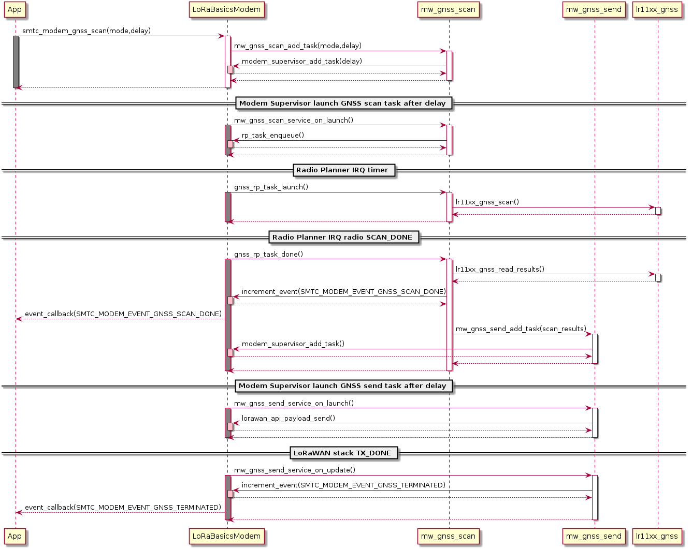

LoRa Basics Modem - Geolocation services
========================================

## 1. Introduction

The LoRa Basics Modem Geolocation Services aim to provide high level API functions to run GNSS/Wi-Fi "scan & send" sequences as simply as possible on LoRa Edge devices.

The services implement the protocols specified by LoRaCloud "Modem and Geolocation Services" in order to simplify end-to-end integration.

The particular protocols involved are:

* the `GNSS Nav-Group (GNSS-NG)` protocol for GNSS scanning with best accuracy positioning.
* the `LoRa Edge Wi-Fi positioning` protocol for Wi-Fi scanning.

The services are split as follows:

* **mw_gnss_scan**: interface with LoRa Edge chip to perform optimized GNSS scan.
* **mw_gnss_send**: interface with LoRa Basics Modem to send GNSS scan results, either as simple LoRaWAN uplinks, or through the Store and Forward service.
* **mw_gnss_almanac**: interface with LoRa Edge chip to perform autonomous almanac update (without LoRaCloud assistance).
* **mw_wifi_scan**: interface with LoRa Edge chip to perform Wi-Fi scan.
* **mw_wifi_send**: interface with LoRa Basics Modem to send Wi-Fi scan results, either as simple LoRaWAN uplinks, or through the Store and Forward service.

The goal is to expose as few parameters as possible to the user application, in order to accomplish pre-defined modes of operation (static device, mobile device, ...) with the best performances.

The user application just has to program the next scan to be launched. The services notify when the operation has completed with events. The services rely on LoRa Basics Modem mechanisms to handle concurrent radio accesses (modem supervisor, radio planner) so that the user application doesn't have to worry about it.

The following sequence diagram illustrates the interactions between the user application, LoRa Basics Modem, the geolocation service and the LR11xx radio, for a typical simplified GNSS scan:

## 2. GNSS scan & send services

The GNSS scan & send services implements the LoRa Edge GNSS-NG (NAV-Group) positioning protocol specified by LoRaCloud.

### 2.1. Scan group (GNSS Nav-Group)

In order to get the best accuracy from GNSS scan results, it is recommended to use the multiframe feature of the solver.

In this context, a scan group is a group of scan results (NAV messages) to be used together to solve a position.

A scan group also has an identifier (a token) used to identify the NAV messages which have to be grouped together for multiframe solving.

A scan group is valid if there is enough scans within the group that meet the expected criteria (minimum number of Space Vehicles detected...). If not valid, the results are not sent over the air.

### 2.2. Scanning modes

Currently there are 2 modes supported, but this could be extended in the future.

* **STATIC mode**: to be used for non-moving objects
* **MOBILE mode**: to be used for mobile objects

Selecting a particular mode indicates to the service how operations must be sequenced to get the best performances.

#### 2.2.1 STATIC mode

When this mode is selected, with SMTC_MODEM_GNSS_MODE_STATIC, the GNSS scan service runs 2 GNSS scans, with a delay of 15 seconds between the end of a scan and the start of the next one. This delay between scans allow to increase sky diversity and solving position accuracy.

Once the last scan of the NAV group is completed, it sends all scan results to the GNSS send service.

#### 2.2.2 MOBILE mode

When this mode is selected, with SMTC_MODEM_GNSS_MODE_MOBILE, the GNSS scan service runs 2 GNSS scans, with no delay between the end of a scan and the start of the next one. In this case the sky diversity is induced by the movement of the mobile device.

Once the last scan of the NAV group is completed, it sends all scan results to the GNSS send service.

### 2.3. Sending modes

When the GNSS scan service has completed its sequence, it sends the results to the GNSS send service which can be configured with several sending modes:
* SMTC_MODEM_SEND_MODE_UPLINK: a direct LoRaWAN uplink is sent for each scan results. If there is no LoRaWAN coverage when sending, the results are lost.
* SMTC_MODEM_SEND_MODE_STORE_AND_FORWARD: the GNSS send service pushes the results to the store & forward service (see LoRa Basics Modem services). This store & forward service stores the data to the MCU flash memory then it will send it over the air with LoRaWAN uplinks when there is LoRaWAN coverage. In order to ensure that there is coverage, it sends regular LoRaWAN confirmed uplinks. If no ACK is received from the Network, it retries later.
* SMTC_MODEM_SEND_MODE_BYPASS: no uplink is sent. It can be used if the user application wants to send results in its own way.

### 2.4. Events notification

In order to inform the user application about the GNSS "scan & send" sequence status, the services send several events to indicate what happened and allow the user application to take actions.

* SMTC_MODEM_EVENT_GNSS_SCAN_DONE: This event is always sent, at the end of the scan sequence (before sending results over the air). It is also sent if the scan group has been aborted, or if it is not valid.
* SMTC_MODEM_EVENT_GNSS_TERMINATED: This event is always sent, at the end of the send sequence (even if nothing has been sent). It indicates the number of uplinks that have actually been sent.

The data associated with an event can be retrieved by the user application by calling the following APIs:
* smtc_modem_gnss_get_event_data_scan_done()
* smtc_modem_gnss_get_event_data_terminated()

The data that can be retrieved are:
* Is the NAV group valid ?
* The token of the group
* The number of valid scans within the group
* The NAV messages buffers
* The power consumption
* Indoor detected ?
* The number of scans sent over the air

Note: The GNSS scan is completed only once both SMTC_MODEM_EVENT_GNSS_SCAN_DONE and SMTC_MODEM_EVENT_GNSS_TERMINATED events have been sent by the services. It is only from that point that another GNSS scan can be programmed.

### 2.5. Internal choices

In order to reach an acceptable trade-off for performances, power consumption and simplicity, some parameters have been set in the service, and are not configurable from the API.

* A maximum of 10 Space Vehicles detected per NAV message: allow good accuracy while still being able to transmit a complete NAV message in 1 uplink (49 bytes maximum).
* LR11xx scan parameters: dopplers are always enabled in NAV messages, time demodulation is always enabled, middle effort mode is used.
* A scan group is valid as soon as there is 1 valid scan in the group. So multiframe may not be always achieved depending on conditions during the scan group sequence.
* If time has not been demodulated, the scan group is stopped and set as not valid. No NAV message is sent.
* If MOBILE mode is selected, the GNSS scan service does not tolerate more than 2 seconds between the end of a scan and the next one.
* Each scan results is sent as a dedicated LoRaWAN uplink.

### 2.6. Default options

We have made the choice to keep configuration parameters as low as possible for a standard usage of the GNSS scan & send services.

By default:
* The GNSS constellations used are: GPS & BEIDOU
* Each scan results is sent as a dedicated LoRaWAN uplink on port 192 with send mode SMTC_MODEM_SEND_MODE_UPLINK.
* The scan group token is incremented by 1 for each valid scan group.

### 2.7. Advanced options

Some default parameters can be overruled for specific use cases:

* The constellations to be used: use GPS only, BEIDOU only
* The port on which the LoRaWAN uplink is sent. WARNING: it should be changed accordingly on LoRaCloud side to keep integration functional.
* The send mode can be set for direct LoRaWAN uplink, store & forward, or bypass.
* Several scan groups can be aggregated together by keeping the same token. It can be useful for non-mobile objects for multiframe solving with a sliding window.

### 2.8. Internals of the GNSS scan & services

The main role of the services is to ease the usage of the LR11xx radio and avoid conflicts between the radio usage for GNSS scanning and other concurrent tasks in an application (transmitting packets, almanac update...).

For this, the GNSS scan service heavily relies on LoRa Basics Modem (LBM) and in particular its Supervisor and Radio Planner.
In LBM, the Radio Planner is responsible for arbitrating the radio usage and ensure that only one user accesses it at a time.

So, when the user calls the smtc_modem_gnss_scan() function to start a GNSS scan in the specified delay, the following happens:
* a task is added to the LBM supervisor, by calling mw_gnss_scan_add_task().
* when it is time for the supervisor to launch the task, it calls mw_gnss_scan_service_on_launch(), which enqueues an ASAP task in the Radio Planner. An ASAP task means that if the radio is already busy at the requested time, the task will be shifted and executed As Soon As Possible.
* when the Radio Planner grants access to the radio to execute the task, it calls the gnss_rp_task_launch() callback. The LR11xx radio is ready to be configured to perform the first scan of the scan group.
* once the LR11xx radio has completed the scan, the Radio Planner calls the gnss_rp_task_done() callback function. This function gets the scan results, process errors...
* the gnss_rp_task_done() callback function sends a SMTC_MODEM_EVENT_GNSS_SCAN_DONE event to the application.
* then, either it is the last scan of the group and it sends results to the GNSS send service, or it is not the last and it programs the next scan of the NAV group.

Once the above sequence has completed, the GNSS scan service has completed its job, and give hands to the GNSS send service by calling the mw_gnss_send_add_task() function. The following happens:
* a task is added to the LBM supervisor. If nothing has to be sent, it just sends the SMTC_MODEM_EVENT_GNSS_TERMINATED event to the user application and exits.
* If there are results to be sent, when it is time for the supervisor to launch the task, it calls mw_gnss_send_service_on_launch(), which either requests an uplink to LBM if send mode SMTC_MODEM_SEND_MODE_UPLINK is selected, or pushes results to the store and forward service if SMTC_MODEM_SEND_MODE_STORE_AND_FORWARD is selected.
* Once all results have been sent, the SMTC_MODEM_EVENT_GNSS_TERMINATED event is sent to the user application.

### 2.9. Prerequisites for a GNSS scan

The GNSS scan service relies on the LR11xx firmware version greater than 0x401 which doesn't need any cloud assistance to get time and assistance position. The LR11xx autonomously demodulates time and computes an assistance position locally.

An up-to-date almanac is required to have optimal performances, and for this there are 2 solutions:
* use the on-device almanac demodulation service described in this document. No downlink from the network is required.
* use the LoRaCloud almanac update service, downlinks are required in this case.

### 2.10. GNSS scan results payload format

The payload format is inline with the `GNSS Nav-Group (GNSS-NG)` protocol from LoRaCloud.

The format is the following:

| scan group last NAV | RFU    | scan group token | NAV message        |
|---------------------|--------|------------------|--------------------|
| 1 bit               | 2 bits | 5 bits           | 49 bytes max       |

* scan group last NAV: indicates that this scan is the last of a scan group.
* scan group token: it is the identifier of the current scan group. It is used to group the NAV message which should be used as a multiframe solving request.
* NAV message: it is the GNSS scan result returned by the LR11xx radio. The actual size depends on the number of Space Vehicle detected by the scan.

The maximum size of the complete payload has been kept under 51 bytes to match with the maximum payload size allowed by the LoRaWAN Regional Parameters for most regions (there are few exceptions like DR0 of the US915 region which therefore cannot be used).

### 2.11. Cancelling a GNSS scan

The GNSS scan service  API provides a function smtc_modem_gnss_scan_cancel() which can be used by the user application to cancel a programmed scan operation.

It is important to note that a scan can be cancelled only if the corresponding task has not yet been launched. A scan task which has been launched cannot be aborted and will complete (both scan and send).

A scan task is considered "launched" when the delay to start the scan has elapsed and the LBM has granted access to the radio.

If cancelling was not possible, the user needs to wait for the SCAN_DONE and TERMINATED events.

### 2.12. LoRaWAN datarate considerations

As seen in the section `GNSS scan results payload format` , due to the maximum length of the scan results payload, some LoRaWAN datarates cannot be used to transmit the results.

Also, depending on the region of operation and how often it is required to get a position for the final application, much care should be taken of the datarates used.

It is **mandatory** to disable the "Network Controlled" mode for Adaptative Datarate (ADR) and rather used custom profiles.
In this custom profiles, it is generally more efficient to use fast datarates, and increase the number of retransmission.

It is to be noted that the same ADR configuration will be used for sending geolocation scan results and application specific payloads.

### 2.13. API & files

The GNSS scan & send API functions are available in the lbm_lib/smtc_modem_api/smtc_modem_geolocation_api.h file.

The implementation of the services is in the following files:
* GNSS scan service: mw_gnss_scan.h/c
* GNSS send service: mw_gnss_send.h/c

## 3. GNSS almanac demodulation service

### 3.1. Description

The almanac demodulation service is an alternative to the LoRaCloud almanac update service which relies on the LR11xx capability to scan and demodulate almanac information emitted by GPS and Beidou space vehicles.
Contrary to the LoRaCloud almanac update service, this service doesn't require any downlink to update the almanac stored in LR11xx flash memory. Which means that a device doesn't need to be connected to any network to update its internal almanac.

Once started, using the smtc_modem_almanac_demodulation_start() API function, the service is completely autonomous and runs without any need of interaction with the user application.

Though, the prerequisite for this service is that a GNSS scan has been done previously with time demodulation.

The main principle is that, once time is available in LR11xx, the service gets the almanac status from the LR11xx radio.
This status contains how many SVs need their almanac to be update, and when the next scan for almanac must be done.
Based on this, the service programs a scheduled Radio Planner task to start the scan at a precise time (with warmup pre-delay).
When the scan completes, if demodulation succeeded, the almanac is updated in flash by the LR11xx radio, and the service gets the time for next almanac scan to be done.
This sequence continues in background until the update is considered complete. Once the almanac is considered complete for all SVs, the service will perform regular check (once every 8 hours) to update any almanac which may have become obsolete.

Note: the almanac is considered complete for a particular constellation when there is less than 2 SVs remaining to be updated. This means that the service never expects the update to be 100% complete.

### 3.2. Events notification

In order to inform the user application about the almanac update status, the service sends a SMTC_MODEM_EVENT_GNSS_ALMANAC_DEMOD_UPDATE event each time it runs. The user application does not have any action to take, it is just for information.

The data associated with the event contain the update progress for each constellation and some statistics.
Those data can be retrieved by the user application by calling the smtc_modem_almanac_demodulation_get_event_data_almanac_update() API.

### 3.3. Internal choices

Both the almanac demodulation service and the GNSS scan service have been designed to run independently. There is no direct connection between them. The only implicit connection is that the almanac demodulation service needs the LR11xx to have performed a first GNSS scan with time demodulation. This is checked by the almanac demodulation service through the lr11xx_gnss_read_time() function call.

It is not possible to mix almanac update from LoRaCloud service and almanac demodulation service. They must be used exclusively.

### 3.4. Default options

We have made the choice to keep configuration parameters as low as possible for a standard usage of the service.

By default:
* Both GPS & Beidou constellations are enabled for almanac update.

### 3.5. Advanced options

The constellations enabled for almanac update can be overruled to select GPS only or Beidou only if needed.

Note: the constellation(s) enabled with the smtc_modem_almanac_demodulation_set_constellations() API functions only impacts the almanac update, not the GNSS scan service.

### 3.6. Internals

The almanac demodulation service relies on both the LBM supervisor and the radio planner to run its update sequence.
* the supervisor is used to set a low priority task which run with the granularity of the second.
* the radio planner is used to set a task with milliseconds time precision. Typically to start a scan for an almanac.

Once the user application has called the smtc_modem_almanac_demodulation_start() API function, the following happens:
* a task is added to the LBM supervisor by calling the mw_gnss_almanac_add_task() function.
* when the supervisor launches this task, it calls the mw_gnss_almanac_service_on_launch() callback which requests access to the LR11xx radio by enqueuing an ASAP task into the radio planner task list.
* when the radio planner grants access to the LR11xx radio, it calls the gnss_almanac_rp_task_launch() callback.
* the gnss_almanac_rp_task_launch() callback function has 2 possible execution paths to:
    * either configure the next task to be programmed based on lr11xx_gnss_read_almanac_status(), or specific errors handled.
    * or configure the radio for almanac scan and start the scan by calling lr11xx_gnss_almanac_update_from_sat().
* depending on the previous execution path, the next supervisor or radio planner task is programmed.

The nominal sequence when a full almanac update is on-going is that the service runs from a radio planner task to the next one based on the next time given by lr11xx_gnss_read_almanac_status().
Though there are few specific cases for which the service will program the next task at specific times:
* No time is available in LR11xx: program a supervisor task in ALMANAC_STATUS_CHECK_PERIOD_NO_TIME_S seconds.
* The current time accuracy is too low: program a supervisor task in ALMANAC_STATUS_CHECK_PERIOD_TIME_ACCURACY_S seconds.
* Bad sky conditions have been detected based on scan results: program a supervisor task in ALMANAC_STATUS_CHECK_PERIOD_BAD_SKY_S seconds.
* Almanac update is considered complete: program a supervisor task in ALMANAC_STATUS_CHECK_PERIOD_DEFAULT_S seconds.
* The radio planner task for almanac has been aborted: program a supervisor task in ALMANAC_STATUS_CHECK_PERIOD_NO_TIME_S seconds.

### 3.7. Time keeping

In order to maintain its internal time, the LR11xx expects the lr11xx_gnss_read_time() function to be called at least once every 24 hours.

The almanac demodulation service will ensure this happen, and if it detects that there is more than 24 hours between 2 calls to lr11xx_gnss_read_time(), it will reset the LR11xx time. This means that next GNSS scan will be a cold start scan. If time is demodulated, it switches back to assisted.

### 3.8. Task priorities

As the service runs in background autonomously, it has to cohabit with other running services. The radio planner does this arbitration.
Due to its timing constraints and the importance of having an almanac up-to-date for good and efficient GNSS scan performances, the almanac demodulation service has the highest priority in term of radio planner task priority (below suspend), until the on-chip doppler solver succeeds in computing an assistance position.

From the radio planner point of view, an almanac task is of type RP_TASK_STATE_SCHEDULE because it needs to start "on time" (must not be delayed). Contrary to a GNSS/Wi-Fi scan task which is RP_TASK_STATE_ASAP, meaning that it can be delayed by a higher priority task.

But once an assistance position has been computed (doppler solver success), the almanac task is still of type RP_TASK_STATE_SCHEDULE but with schedule_task_low_priority set to true. In this case, it is like an ASAP task that must start on time. With this configuration:
* the almanac task can be aborted by another ASAP task (GNSS/WiFi scan, LoRa TX...) which has been postponed for too long (switched to SCHEDULED).
* it is still higher priority than other ASAP tasks if an arbitration must be done. (it can still abort a running GNSS scan).

If the almanac task is aborted too many times, the service sets the next task as high priority (schedule_task_low_priority to false).

The check on doppler solver result is done after each almanac scan. So if, for some reason, the almanac become too old (no sky view for several months...), the doppler solver may fail. In this case, the service sets schedule_task_low_priority to false until doppler solver succeeds again.

The rational behind all this is to let the almanac update progress as fast as possible until a GNSS scan can be assisted (to lower power consumption).

### 3.9. API & files

The almanac demodulation service API functions are available in the lbm_lib/smtc_modem_api/smtc_modem_geolocation_api.h file.

The implementation of the service is in the following files:
* mw_gnss_almanac.h/c

## 4. Wi-Fi scan & send services

The Wi-Fi scan & send services implements the LoRa Edge Wi-Fi positioning protocol specified by LoRaCloud.

Contrary to the GNSS scan service, there is no scan group concept in the Wi-Fi middleware, and no multiframe solving.

A Wi-Fi scan simply returns the list of Access Points MAC address that have been detected (and optionally RSSI), and send it to the solver within one uplink message.

### 4.1. Events notification

In order to inform the user application about the Wi-Fi "scan & send" sequence status, the services sends several events to indicate what happened and allow the user application to take actions.

* SMTC_MODEM_EVENT_WIFI_SCAN_DONE: This event is always sent, at the end of the scan sequence (before sending results over the air). It is also sent if the scan has been aborted, or if it is not valid.
* SMTC_MODEM_EVENT_WIFI_TERMINATED: This event is always sent, at the end of the send sequence (even if nothing has been sent). It indicates the number of uplinks that have been sent.

The data associated with an event can be retrieved by the user application by calling the following APIs:
* smtc_modem_wifi_get_event_data_scan_done()
* smtc_modem_wifi_get_event_data_terminated()

### 4.2. Internal choices

The following parameters are set by the Wi-Fi scan service, and are not configurable from the API.

* A Minimum of 3 Access Points must be detected to get a valid scan.
* The scan will stop when a maximum of 8 Access Points have been detected.
* A maximum of 5 Access Points among those detected are sent over the air (sorted by decreasing power).
* All channels are enabled to be scanned.
* A scan will look for Beacons of type B, G and N.
* The maximum time spent scanning a channel is set to 300ms
* The maximum time spent for preamble detection for each single scan is set to 90ms

*Note*: The current implementation is very basic, and does not provide the best performances possible in terms of accuracy and power consumption. It will be improved in further version.

### 4.3. Default options

We have made the choice to keep configuration parameters as low as possible for a standard usage of the services.

By default:
* Each scan results is sent as a dedicated LoRaWAN uplink on **port 197**.
* The frame format used is **WIFI_MW_PAYLOAD_MAC**.

### 4.4. Advanced options

Some default parameters can be overruled for specific use cases:

* The port on which the LoRaWAN uplink is sent. WARNING: it should be changed accordingly on LoRaCloud side to keep integration functional.
* The send mode can be set for direct LoRaWAN uplink, store & forward, or bypass.

### 4.5. Internals of the Wi-Fi scan & services

The main role of the services is to ease the usage of the LR11xx radio and avoid conflicts between the radio usage for Wi-Fi scanning and other concurrent use for other tasks in an application (transmitting packets...).

For this, the Wi-Fi scan service heavily relies on LoRa Basics Modem (LBM) and in particular its Supervisor and Radio Planner.
In LBM, the Radio Planner is responsible for arbitrating the radio usage and ensure that only one user accesses it at a time.

So, when the user calls the smtc_modem_wifi_scan() function to start a Wi-Fi scan in the specified delay, the following happens:
* a task is added to the LBM supervisor, by calling mw_wifi_scan_add_task().
* when it is time for the supervisor to launch the task, it calls mw_wifi_scan_service_on_launch(), which enqueues an ASAP task in the Radio Planner. An ASAP task means that if the radio is already busy at the requested time, the task will be shifted and executed As Soon As Possible.
* when the Radio Planner grants access to the radio to execute the task, it calls the wifi_rp_task_launch() callback. The LR11xx radio is ready to be configured to perform the scan.
* once the LR11xx radio has completed the scan, the Radio Planner calls the wifi_rp_task_done() callback function. This function gets the scan results, process errors...
* the wifi_rp_task_done() callback function sends a SMTC_MODEM_EVENT_WIFI_SCAN_DONE event to the application and then sends the results to the WI-Fi send service.

Once the above sequence has completed, the Wi-Fi scan service has completed its job, and give hands to the Wi-Fi send service by calling the mw_wifi_send_add_task() function. The following happens:
* a task is added to the LBM supervisor. If nothing has to be sent, it just sends the SMTC_MODEM_EVENT_WIFI_TERMINATED event to the user application and exits.
* If there are results to be sent, when it is time for the supervisor to launch the task, it calls mw_wifi_send_service_on_launch(), which either requests an uplink to LBM if send mode SMTC_MODEM_SEND_MODE_UPLINK is selected, or pushes results to the store and forward service if SMTC_MODEM_SEND_MODE_STORE_AND_FORWARD is selected.
* Once the results have been sent, the SMTC_MODEM_EVENT_WIFI_TERMINATED event is sent to the user application.

### 4.6. Wi-Fi Scan results payload format

The format of the payload is described by the `LoRa Edge Wi-Fi positioning protocol` of LoRaCloud.

There are 2 formats possible, that the user can choose:

* `WIFI_MW_PAYLOAD_MAC`: contains only the MAC addresses of the detected Access Points
* `WIFI_MW_PAYLOAD_MAC_RSSI`: contains the MAC addresses of the detected Access Points and the strength of the signal at which it has been detected.

The Wi-Fi scan service only uses the WIFI_MW_PAYLOAD_MAC format.

The maximum size of the complete payload has been kept under 51 bytes to match with the maximum payload size allowed by the LoRaWAN Regional Parameters for most regions (there are few exceptions like DR0 of the US915 region which therefore cannot be used).

#### 4.6.1. Wi-Fi results payload format with MAC addresses only

| 0x00 | AP1 MAC address | AP2 MAC address | ... | APn MAC address |
|------|-----------------|-----------------|-----|-----------------|
|      | 6 bytes         | 6 bytes         | ... | 6 bytes         |

#### 4.6.1. Wi-Fi results payload format with MAC addresses and RSSI

| 0x01 | AP1 RSSI | AP1 MAC address | AP2 RSSI | AP2 MAC address | ... | APn RSSI | APn MAC address |
|------|----------|-----------------|----------|-----------------|-----|----------|-----------------|
|      | 1 byte   | 6 bytes         | 1 byte   | 6 bytes         | ... | 1 byte   | 6 bytes         |

### 4.7. Cancelling a Wi-Fi scan

The API provides a function smtc_modem_wifi_scan_cancel() which can be used by the user application to cancel a programmed scan & send operation.

It is important to note that a scan can be cancelled only if the corresponding task has not yet been launched. A scan task which has been launched cannot be aborted and will complete (both scan and send).

A scan task is considered "launched" when the delay to start the scan has elapsed and the LBM has granted access to the radio.

If cancelling was not possible, the user needs to wait for the SCAN_DONE and TERMINATED events.

### 4.8. LoRaWAN datarate considerations

As seen in the section `Wi-Fi scan results payload format`, due to the maximum length of the scan results payload, some LoRaWAN datarates cannot be used to transmit the results.

Also, depending on the region of operation and how often it is required to get a position for the final application, much care should be taken of the datarates used.

It is **mandatory** to disable the "Network Controlled" mode for Adaptative Datarate (ADR) and rather used custom profiles.
In this custom profiles, it is generally more efficient to use fast datarates, and increase the number of retransmission.

It is to be noted that the same ADR configuration will be used for sending geolocation scan results and application specific payloads.

### 4.9. API & files

The Wi-Fi scan & send API functions are available in the lbm_lib/smtc_modem_api/smtc_modem_geolocation_api.h file.

The implementation of the services is in the following files:
* Wi-Fi scan service: mw_wifi_scan.h/c
* Wi-Fi send service: mw_wifi_send.h/c
